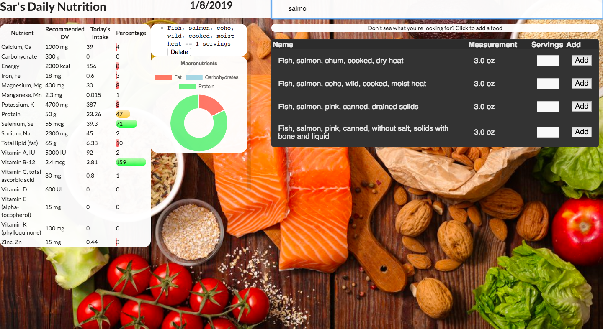
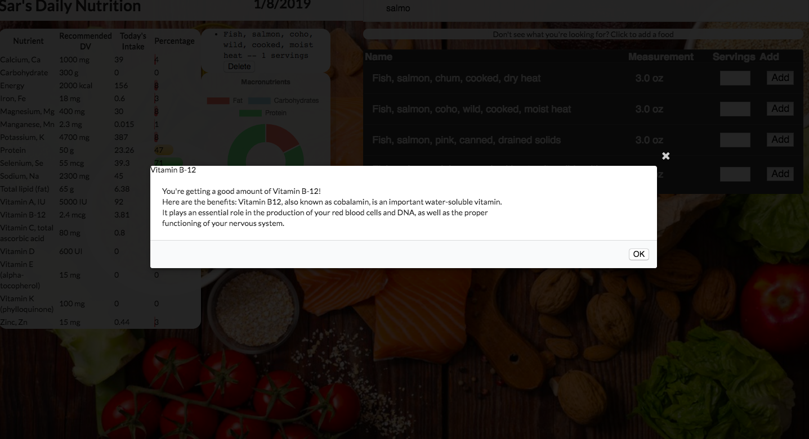
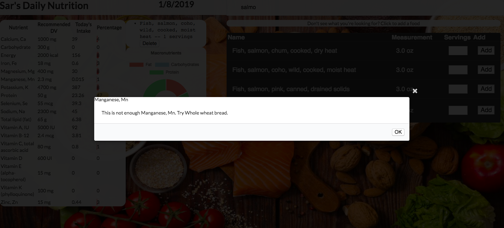

A Javascript App that allows a user to record their daily food intake, outputting their macronutrient count, recommended micronutrient intake and proximity to their goals, and recommendations and information about why each nutrient is important.

The user can use the search functionality to search for and find what they ate during the day. The food is pulled from the USDA API and seeded using a ruby backend. The user then saves the food to their daily log and the nutrients will be calculated and compared to the daily recommendations. A chart of macronutrients will update which shows how much protein, carbohydrates, and fat the user has consumed.

If the user has hit the daily recommendations for their nutrients, they will be able to click on the nutrient and open a modal window which tells them the benefits of the nutrient that they have obtained.

If the user has not hit 75% of the daily recommendation for the nutrient, they will be able to click and have a modal come up that makes a recommendation and tells them what they should eat that is nutrient dense and will get them closer to fulfilling the daily recommendation.

The user can also click on a nutrient that they are curious about, and a modal will pop up that tells the user why the nutrient is important.
